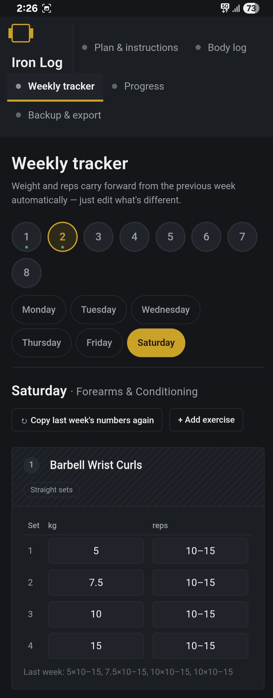
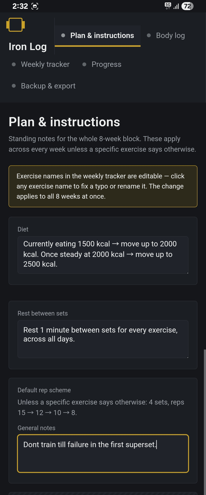
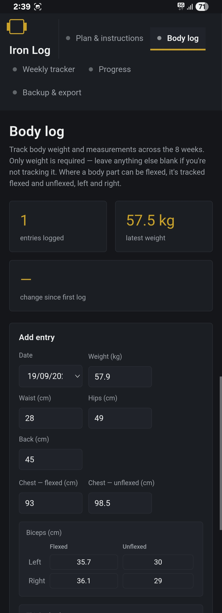
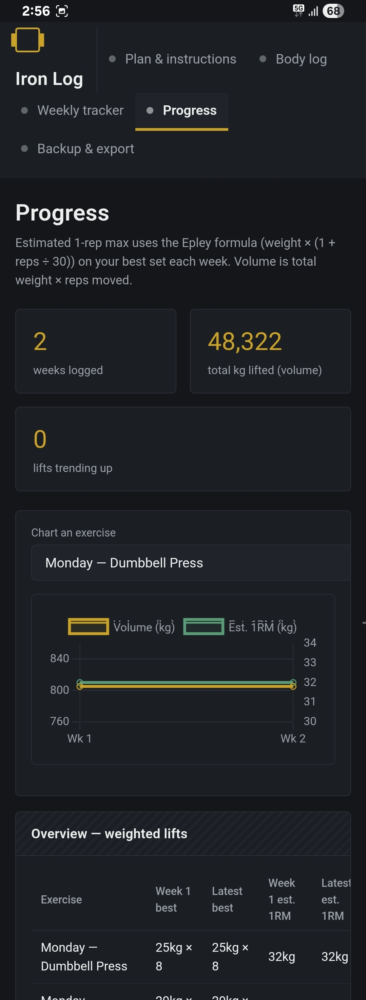
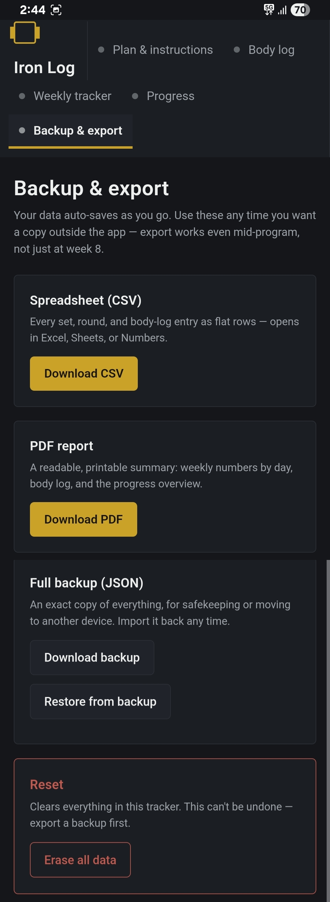
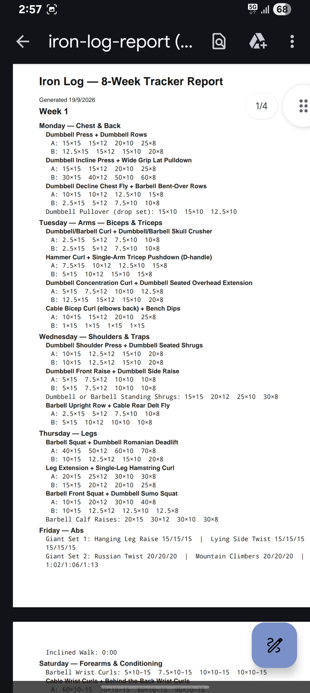

# Iron Log

A personal 8-week workout tracking application developed for Android and the web, built with a shared HTML/CSS/JavaScript interface and a native Kotlin Android layer.

## Project Links

- 🌐 **Live Demo:** Coming soon
- 📱 **Android APK:** Coming soon
- 💻 **Source Code:** This repository

## Table of Contents

- [Overview](#overview)
- [Features](#features)
- [Screenshots](#screenshots)
- [Technical Stack](#technical-stack)
- [Architecture](#architecture)
- [Data Management](#data-management)
- [Export and Backup](#export-and-backup)
- [Android-Specific Implementation](#android-specific-implementation)
- [Project Structure](#project-structure)
- [Technical Challenges and Solutions](#technical-challenges-and-solutions)
- [What I Learned](#what-i-learned)
- [Future Improvements](#future-improvements)
- [License](#license)

## Overview

Iron Log is a workout and fitness progress tracking application developed in both Android and standalone web versions as a hands-on software project.

### Android Version

The Android version combines a native Kotlin layer with a self-contained HTML/CSS/JavaScript interface running inside an Android WebView. It supports structured 8-week workout tracking, exercise and body-progress monitoring, data visualization, report generation, and complete data backup and restoration. The application was developed and tested end-to-end on a physical Android device, with particular focus on WebView integration, JavaScript-to-Kotlin communication, local data persistence, Android file handling, mobile touch interactions, and real-world debugging.

### Web Version

The web version is a standalone HTML/CSS/JavaScript application that runs directly in modern web browsers. It provides the core workout tracking, progress monitoring, data visualization, reporting, and backup features without requiring an Android installation.

Both versions share the same core HTML/CSS/JavaScript tracking interface while the Android version adds native Android integration for device-specific functionality such as file handling.

## Features

**Weekly training log**
- 8-week program structure with a fixed weekly split, editable per exercise
- Multiple exercise formats: straight sets, supersets, drop sets, giant sets (rep-based, timed, and mixed rep/timer), plate-only logging, and free-running stopwatch timers for timed exercises
- Each new week auto-copies the previous week's logged weights and reps as an editable starting point, so nothing has to be re-typed from scratch

**Body measurement log**
- Body weight over time, plus circumference measurements
- Paired limbs (biceps, thighs, calves, forearms) tracked left/right and flexed/unflexed independently

**Progress tracking**
- Estimated one-rep max (Epley formula) and training volume calculated per exercise, per week
- Chart.js line charts for weight trend and per-exercise progress
- Summary stats (weeks logged, total volume, trending lifts) computed only from weeks with real entries, not merely-visited weeks

**Backup and reporting**
- CSV export of the full training log
- Full-state JSON backup, with restore from a previously exported file
- Multi-page PDF report generated entirely client-side

## Screenshots

### Weekly Tracker



### Plan & Instructions



### Body Log



### Progress Tracking



### Backup & Export



### Generated PDF Report



## Technical Stack

### Android
- Kotlin
- Single-`Activity`, `WebView`-hosted UI (no Jetpack Compose, no XML layouts beyond the activity theme)
- AndroidX: `core-ktx`, `activity-ktx`, `appcompat`
- Gradle Kotlin DSL (`build.gradle.kts`) build configuration

### Frontend / Web
- Plain HTML5, CSS3, and vanilla JavaScript (no framework, no build tooling)
- `localStorage` for client-side persistence

### Libraries / APIs
- [Chart.js](https://www.chartjs.org/) (UMD build, bundled inline) — progress charts
- [jsPDF](https://github.com/parallax/jsPDF) (UMD build, bundled inline) — PDF report generation
- Android `MediaStore` API (scoped storage file writes)
- Android `ActivityResultContracts.OpenDocument` (file picker for restore)
- `WebView.addJavascriptInterface` (JS-to-native bridge)

## Architecture

Iron Log is a hybrid app: nearly all logic lives in the bundled web layer, with a thin native layer for OS-level file I/O.

<details>
<summary>Architecture diagram</summary>

```
Android Activity (MainActivity)
      |
      v
   WebView  (javaScriptEnabled, domStorageEnabled)
      |
      v
HTML / CSS / JavaScript  (file:///android_asset/index.html)
      |
      +---- localStorage (all app state — training log, body log, settings)
      |
      +---- Chart.js / jsPDF (bundled inline, no CDN dependency)
      |
      +---- JavaScript bridge (window.AndroidBridge)
                  |
                  v
          WebAppInterface (Kotlin, @JavascriptInterface)
                  |
                  +---- MediaStore.Downloads (Android 10+)
                  +---- Direct file write (Android 9 and below, permission-gated)
```

</details>

The web app is written to run standalone in any modern browser as well — it detects at runtime whether `window.AndroidBridge` exists and only changes its file-export behavior when running inside the Android shell. This keeps a single HTML/JS codebase working in both contexts without a fork.

## Data Management

Both the Android and web versions use browser-based `localStorage` for client-side application state, including the 8-week training log, body measurements, and instructions.

In the Android version, the WebView requires `WebSettings.domStorageEnabled = true` for `localStorage` persistence between app sessions. The web version uses the browser's native `localStorage` implementation directly.

No backend database or remote server is required for the core application data.

## Export and Backup

Three export formats are generated entirely on the client:

- **CSV** — the training log flattened into rows, generated as a plain string
- **JSON** — a full snapshot of the app's `localStorage` state, used for backup and restore
- **PDF** — built with jsPDF's core drawing API (text and manual layout rather than a table plugin), producing a multi-page report

In a browser, these are triggered with the standard `Blob` + `<a download>` pattern. That pattern does not work inside Android's WebView — there is no default handler for `blob:` URLs, so a triggered download silently does nothing. To handle this, the export functions check for `window.AndroidBridge` and, when present, hand the file's bytes (or base64, for the PDF) to a native method instead:

```javascript
if (window.AndroidBridge && window.AndroidBridge.saveFile) {
  window.AndroidBridge.saveFile(filename, content, mime, isBase64);
} else {
  // normal browser Blob + <a download> fallback
}
```

On the Kotlin side, `WebAppInterface.saveFile()` writes the file via `MediaStore.Downloads` on Android 10+ (no permission required, scoped-storage compliant), or a direct `FileOutputStream` into the public Downloads directory on Android 9 and below (gated behind a runtime `WRITE_EXTERNAL_STORAGE` permission request).

**Restore** uses a hidden `<input type="file" accept=".json">` in the web UI. Triggering a file picker for this input from inside a WebView requires the host app to implement `WebChromeClient.onShowFileChooser()` — without it, tapping the input does nothing. This is implemented using the modern `ActivityResultContracts.OpenDocument()` API rather than the deprecated `startActivityForResult` pattern.

## Android-Specific Implementation

- **WebView configuration**: `javaScriptEnabled`, `domStorageEnabled`, `allowFileAccess`, `useWideViewPort`, and `loadWithOverviewMode` are all explicitly set; the app is loaded from `file:///android_asset/index.html`.
- **JavaScript interface**: a single `@JavascriptInterface`-annotated inner class (`WebAppInterface`), exposed to the page as `window.AndroidBridge`, with one method (`saveFile`) handling all three export types.
- **File picker**: `WebChromeClient.onShowFileChooser()` overridden and backed by an `ActivityResultContracts.OpenDocument()` launcher registered at activity construction time.
- **Storage permissions**: `WRITE_EXTERNAL_STORAGE` is declared with `android:maxSdkVersion="28"`, so it is never requested (and not needed) on Android 10+.
- **No `INTERNET` permission**: both bundled libraries (Chart.js, jsPDF) are inlined directly into the HTML asset rather than loaded from a CDN, so the app has no network dependency for its core functionality.
- **Back navigation**: `onBackPressed` first checks `webView.canGoBack()` and navigates back when possible; otherwise, it falls back to the default activity-finish behavior.
- **App icon**: adaptive icon plus legacy mipmap densities, generated from the app's own SVG mark.

## Project Structure

<details>
<summary>Expand project tree</summary>

```
IronLogApp/

├── app/
│   └── src/
│       └── main/
│           ├── assets/
│           │   └── index.html          # entire web app (HTML + CSS + JS, libraries inlined)
│           ├── java/com/ironlog/app/
│           │   └── MainActivity.kt     # WebView host + JS bridge + file I/O
│           ├── res/
│           │   ├── mipmap-*/           # launcher icons (all densities)
│           │   ├── mipmap-anydpi-v26/  # adaptive icon
│           │   └── values/             # strings, colors, theme
│           └── AndroidManifest.xml
├── docs/
│   └── screenshots/                     # project screenshots
├── build.gradle.kts
├── app/build.gradle.kts
├── settings.gradle.kts
├── gradle.properties
└── gradle/wrapper/

```

</details>

## Technical Challenges and Solutions

**WebView downloads don't work like browser downloads.** The standard `Blob` + `<a download>` pattern used by the web app has no effect inside Android's WebView — there's no default download handler for `blob:` URLs. Solved by adding a JavaScript interface bridge that hands file bytes to native code, which writes them via `MediaStore` (or a direct file write on older Android versions) instead.

**`<input type="file">` does nothing by default in WebView.** The backup-restore feature relies on a native file picker, which WebView does not provide out of the box. Solved by implementing `WebChromeClient.onShowFileChooser()` backed by the `ActivityResultContracts.OpenDocument()` API, connecting the picked document's `Uri` back to the WebView's pending file input callback.

**Scoped storage across Android versions.** Writing files to a shared location changed significantly between older Android versions (direct file paths) and Android 10+ (scoped storage via `MediaStore`). The app branches on `Build.VERSION.SDK_INT` to use the correct approach for each.

**Keeping one codebase for both browser and app use.** Rather than maintaining two versions of the web app, the export logic detects `window.AndroidBridge` at runtime and only changes behavior when it's actually running inside the Android shell.

## What I Learned

- Structuring a native Android host around a WebView-based UI, including the specific settings required for JavaScript and local storage to work correctly
- Building a bidirectional JavaScript-to-native bridge with `@JavascriptInterface`
- Handling file I/O correctly across Android's scoped-storage boundary (Android 9 vs. 10+)
- Using the modern `ActivityResultContracts` API for a WebView file picker, instead of the deprecated `onActivityResult` pattern
- Diagnosing a browser-specific behavior (blob downloads, file input pickers) that silently fails in a WebView, with no error or exception to point to it directly
- Generating multi-density Android launcher icons (including adaptive icons) from a single source asset

## Future Improvements

- Migrate the native shell from a single `WebView` Activity to a Compose-based host, if richer native UI is ever needed alongside the WebView
- Add automated tests around the JavaScript export/restore logic
- Package the web app as an installable PWA as an alternative to the native wrapper, for users who prefer not to install an APK

## License

See the [LICENSE](LICENSE) file for details.
